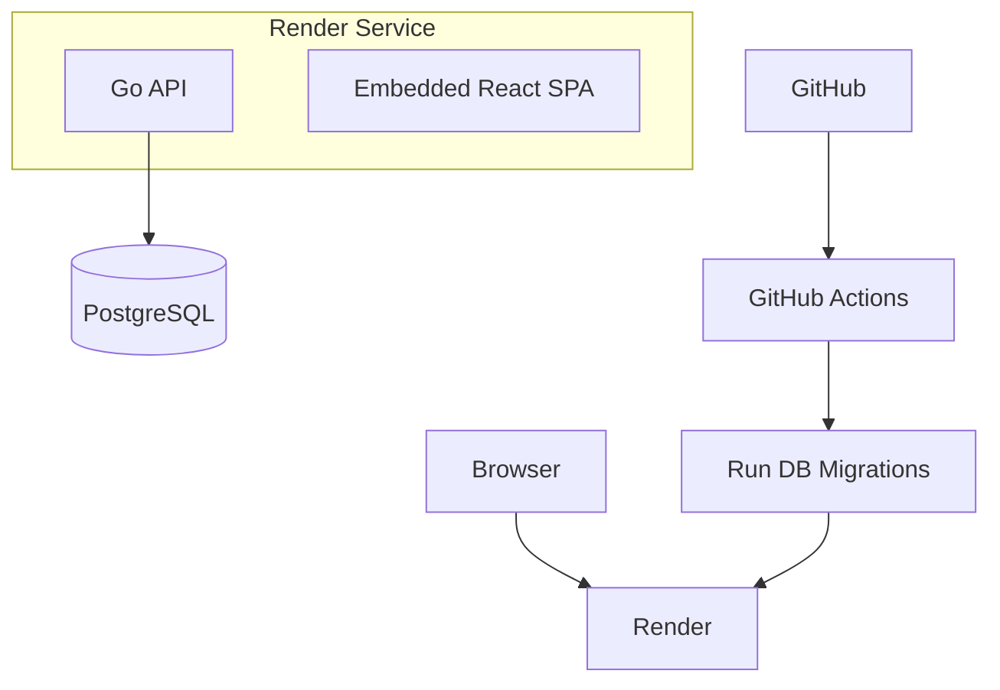

# ADR-0001: deploy-topology

**Status**: Accepted
**Version**: 1.1
**Date**: 2026-06-16
**Author**: Ramdan Agus Saputra

## Context

Selaras is a real-time collaborative Kanban application built as a monorepo containing:

- Go API server
- React SPA frontend
- PostgreSQL database
- GitHub Actions CI/CD pipeline
- Render hosting platform

The project goals are:

- Simple operational model
- Low infrastructure cost
- Fast deployments
- Easy onboarding
- Minimal DevOps overhead
- Production-grade deployment suitable for portfolio/demo usage

The frontend is built and embedded into the Go binary during the Docker build process, allowing the entire application to be deployed as a single container.

### Decision Drivers

The topology choice is constrained by four forces specific to this project's stage:

- **Solo maintainer** — there is no platform/ops team; every moving part is operational cost paid by one person who is also the primary developer.
- **Free / low-cost hosting tier** — Render's free and starter tiers permit a single web service plus one managed database; multi-service or orchestrated topologies incur real monthly cost without delivering value at current scale.
- **Portfolio + demo audience** — the deployment must be reliably reachable and look production-grade to reviewers, but traffic is intermittent and low-volume (demo clicks, not sustained concurrency).
- **Learning vehicle** — the builder is learning Go; infrastructure complexity that obscures the application code or adds non-Go operational surface area works against a stated project goal.

These drivers favor the fewest deployable units that still meet "production-grade demo," and explicitly de-prioritize independent scaling and high availability until there is evidence they are needed (see Future Evolution).

## Decision

Adopt a Single-Service Monolith Deployment Topology.

```text
Internet
    │
    ▼
┌───────────────────┐
│      Render       │
│   Web Service     │
└─────────┬─────────┘
          │
          ▼
┌───────────────────┐
│  Distroless       │
│  Docker Container │
│                   │
│  Go API           │
│  Embedded React   │
└─────────┬─────────┘
          │
          ▼
┌───────────────────┐
│ PostgreSQL 16     │
│ Managed Database  │
└───────────────────┘
```

The application runs as a single stateless container connected to a managed PostgreSQL instance.

## Deployment Topology



## Runtime Architecture

Single production container contains:

```text
/api
/migrate
/migrations
```

Build flow:

1. Build React application
2. Embed React assets into Go server
3. Compile Go binary
4. Produce distroless runtime image

## Network Topology

### External

```text
HTTPS 443
     │
     ▼
Render
```

### Internal

```text
Go API
     │
     ▼
PostgreSQL
```

No internal microservices, queues, or cache tiers currently exist.

## CI/CD Topology

### Pull Requests

```text
PR
 │
 ▼
GitHub Actions
 ├─ Server Lint
 ├─ Server Test
 ├─ Server Build
 ├─ Web Lint
 ├─ Web Typecheck
 ├─ Web Test
 └─ Web Build
```

### Main Branch Deployment

```text
Push main
    │
    ▼
GitHub Actions
    │
    ├─ Server Validation
    ├─ Web Validation
    ├─ Docker Build Verification
    │
    ▼
Run PostgreSQL Migrations
    │
    ▼
Trigger Render Deploy Hook
    │
    ▼
Render Builds & Deploys
```

## Database Topology

### Development

```text
Docker Compose
 └─ PostgreSQL 16
```

### Production

```text
Managed PostgreSQL
```

Database migrations are executed before deployment and gate releases.

## Secrets Management

### GitHub Actions

```text
PROD_DATABASE_URL
RENDER_DEPLOY_HOOK
```

### Render

```text
DATABASE_URL
Application configuration
```

## Alternatives Considered

### Separate Frontend and Backend Deployments

Serve the React SPA from a static host/CDN (e.g. a Render Static Site or Netlify) and run the Go API as a separate web service.

**Rejected.** It doubles the deployable units and the failure/version-skew surface (a deployed frontend can drift ahead of an incompatible API), and it forces a cross-origin setup — CORS configuration, preflight handling, and matching the WebSocket origin policy — that the embedded-asset model avoids entirely by serving SPA and API from one origin. The marginal benefit (independent frontend caching/CDN) is not worth it at demo traffic, and the embedded build already produces a single immutable artifact whose frontend and API are guaranteed to match.

### Kubernetes

Run the container on a managed Kubernetes cluster (GKE/EKS/managed k8s).

**Rejected.** Kubernetes solves orchestration, autoscaling, and multi-service networking problems this project does not have. For a single stateless container it adds a control plane, cluster cost (a managed cluster floor far exceeds Render's single-service tier), and a large operational vocabulary (manifests, ingress, secrets, node upgrades) that one maintainer would carry for zero current benefit. Render's PaaS already provides the only pieces actually needed: HTTPS termination, a deploy hook, and a managed database.

### Microservices

Decompose the API into independently deployed services (e.g. boards, auth, real-time).

**Rejected.** The domain currently fits in a single bounded context with one database; splitting it would introduce network boundaries, distributed-transaction concerns, and inter-service contracts that buy nothing while the whole system is one developer's mental model. Service decomposition is a response to team-scaling and independent-deploy pressure that does not yet exist; doing it now would be premature complexity. The modular internal architecture (domain ← app ← adapter) keeps a future extraction path open without paying the cost today.

## Consequences

### Positive

- One deployable artifact
- One runtime service
- Low cloud cost
- Easy contributor onboarding
- Fast CI/CD

### Negative

- Limited independent scaling
- Larger blast radius for failures
- Future real-time scaling may require architectural evolution

## Future Evolution

Each phase is gated by an observed signal, not a calendar. The current topology stays until a trigger fires.

### Phase 1 — Horizontal replicas

```text
2+ Render Instances
        │
        ▼
Managed PostgreSQL
```

**Trigger:** a single instance can no longer absorb load (sustained high CPU/memory, request latency degradation under demo+real usage) **or** zero-downtime deploys become a requirement. Prerequisite: the service is already stateless, so WebSocket fan-out must move off in-process memory before scaling past one instance (links to Phase 2).

### Phase 2 — Shared real-time / cache tier

```text
Go API
   │
   ├─ PostgreSQL
   └─ Redis
```

**Trigger:** running more than one instance (Phase 1) requires WebSocket broadcast to cross instance boundaries, **or** read load on PostgreSQL warrants a cache. Redis becomes the pub/sub backbone for cross-instance real-time events and an optional cache.

### Phase 3 — Background processing split

```text
Frontend
API
Worker
Redis
PostgreSQL
```

**Trigger:** work appears that should not run in the request path (email/notifications, heavy exports, scheduled jobs) and starts affecting API latency or reliability. A dedicated worker consuming from Redis decouples that work from request handling.

### Phase 4 — Geographic + data scaling

Multi-region deployment, read replicas, background processing, and event-driven architecture.

**Trigger:** a user base distributed across regions makes latency or data-residency a concern, **or** read volume exceeds what a single primary database can serve. This phase represents a genuine architectural shift and would warrant its own ADR.

## Changelog

- **1.1** (2026-06-21): Added Decision Drivers; expanded Alternatives Considered with explicit trade-off rationale; added trigger conditions to Future Evolution phases; added Version field and this changelog.
- **1.0** (2026-06-16): Initial accepted decision — single-service monolith deployment topology.
