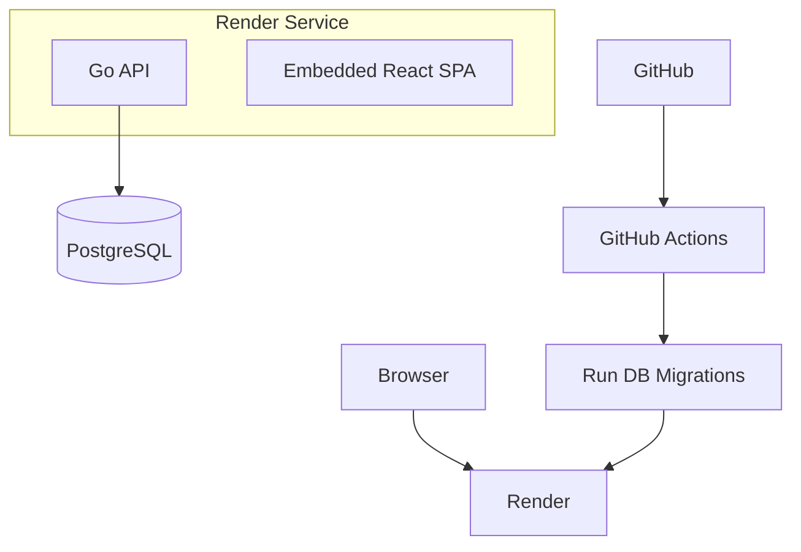

# ADR-0001: deploy-topology

**Status**: Accepted
**Date**: 2026-06-16
**Author**: Ramdan Agus Saputra

## Context

Selaras is a real-time collaborative Kanban application built as a monorepo containing:

- Go API server
- React SPA frontend
- PostgreSQL database
- GitHub Actions CI/CD pipeline
- Render hosting platform

The project goals are:

- Simple operational model
- Low infrastructure cost
- Fast deployments
- Easy onboarding
- Minimal DevOps overhead
- Production-grade deployment suitable for portfolio/demo usage

The frontend is built and embedded into the Go binary during the Docker build process, allowing the entire application to be deployed as a single container.

## Decision

Adopt a Single-Service Monolith Deployment Topology.

```text
Internet
    │
    ▼
┌───────────────────┐
│      Render       │
│   Web Service     │
└─────────┬─────────┘
          │
          ▼
┌───────────────────┐
│  Distroless       │
│  Docker Container │
│                   │
│  Go API           │
│  Embedded React   │
└─────────┬─────────┘
          │
          ▼
┌───────────────────┐
│ PostgreSQL 16     │
│ Managed Database  │
└───────────────────┘
```

The application runs as a single stateless container connected to a managed PostgreSQL instance.

## Deployment Topology



## Runtime Architecture

Single production container contains:

```text
/api
/migrate
/migrations
```

Build flow:

1. Build React application
2. Embed React assets into Go server
3. Compile Go binary
4. Produce distroless runtime image

## Network Topology

### External

```text
HTTPS 443
     │
     ▼
Render
```

### Internal

```text
Go API
     │
     ▼
PostgreSQL
```

No internal microservices, queues, or cache tiers currently exist.

## CI/CD Topology

### Pull Requests

```text
PR
 │
 ▼
GitHub Actions
 ├─ Server Lint
 ├─ Server Test
 ├─ Server Build
 ├─ Web Lint
 ├─ Web Typecheck
 ├─ Web Test
 └─ Web Build
```

### Main Branch Deployment

```text
Push main
    │
    ▼
GitHub Actions
    │
    ├─ Server Validation
    ├─ Web Validation
    ├─ Docker Build Verification
    │
    ▼
Run PostgreSQL Migrations
    │
    ▼
Trigger Render Deploy Hook
    │
    ▼
Render Builds & Deploys
```

## Database Topology

### Development

```text
Docker Compose
 └─ PostgreSQL 16
```

### Production

```text
Managed PostgreSQL
```

Database migrations are executed before deployment and gate releases.

## Secrets Management

### GitHub Actions

```text
PROD_DATABASE_URL
RENDER_DEPLOY_HOOK
```

### Render

```text
DATABASE_URL
Application configuration
```

## Alternatives Considered

### Separate Frontend and Backend Deployments

Rejected due to increased operational complexity and CORS concerns.

### Kubernetes

Rejected due to operational overhead and infrastructure cost.

### Microservices

Rejected because current domain complexity does not justify service decomposition.

## Consequences

### Positive

- One deployable artifact
- One runtime service
- Low cloud cost
- Easy contributor onboarding
- Fast CI/CD

### Negative

- Limited independent scaling
- Larger blast radius for failures
- Future real-time scaling may require architectural evolution

## Future Evolution

### Phase 1

```text
2+ Render Instances
        │
        ▼
Managed PostgreSQL
```

### Phase 2

```text
Go API
   │
   ├─ PostgreSQL
   └─ Redis
```

### Phase 3

```text
Frontend
API
Worker
Redis
PostgreSQL
```

### Phase 4

Multi-region deployment, read replicas, background processing, and event-driven architecture.
